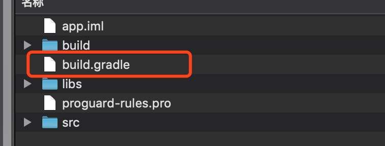
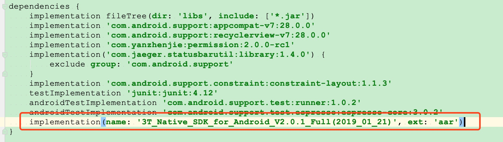

# 音效变声演示

#### 准备工作
1. 在三体云官网SDK下载页 [http://3ttech.cn/index.php?menu=53](http://3ttech.cn/index.php?menu=53) 下载对应平台的 连麦直播SDK。
2. 登录三体云官网 [http://dashboard.3ttech.cn/index/login](http://dashboard.3ttech.cn/index/login) 注册体验账号，进入控制台新建自己的应用并获取APPID。
3. 下载DEMO源码，将APPID填入代码中相应的位置并体验效果。

# 实现步骤

### 相关接口

1. 创建 TTT 音视频引擎对象 [create](http://www.3ttech.cn/index.php?menu=72&type=Android#create)
2. 设置频道模式 [setChannelProfile](http://www.3ttech.cn/index.php?menu=72&type=Android#setChannelProfile)
3. 设置用户角色 [setClientRole](http://www.3ttech.cn/index.php?menu=72&type=Android#setClientRole)
4. 设置音频编码类型和码率 [setPreferAudioCodec](http://www.3ttech.cn/index.php?menu=72&type=Android#setPreferAudioCodec) 
5. 加入频道 [joinChannel](http://www.3ttech.cn/index.php?menu=72&type=Android#joinChannel)
6. 启用本地音频录音裸数据上报 [enableAudioDataReport](http://www.3ttech.cn/index.php?menu=72&type=Android#enableAudioDataReport)
7. 离开频道 [leaveChannel](http://www.3ttech.cn/index.php?menu=72&type=Android#leaveChannel)
8. 启用变声 enableAudioEffect

```
/**
 * 启动本地录制声音的音效
 * <p/>
 * 该 API 通过处理采集出的音频数据，实现变声的音效效果，如机器人等。需要和 enableAudioDataReport API 一起配合使用，如果启用音效，enableAudioDataReport 的第一个参数设置为 true ，反之关闭时设置 false 即可，两个 API 无顺序限制，谁先调用都可以，但两者缺一不可。
 * <p/>
 * 支持频道内的动态开和关，离开频道后音效功能自动关闭，音效类型定义在 Constants 类中，调用方式为 Constants.WSAUDIO_EFFECT_DELAY 。切换音效类型重复调用此接口即可。
 *
 * @param enabled    true 代表启用音效功能，false 代表关闭音效功能
 * @param effectType 音效类型。 1、WSAUDIO_EFFECT_DELAY-澡堂(回音壁) 。2、WSAUDIO_EFFECT_PITCHSHIFT_LOW-低沉(大叔) 。3、WSAUDIO_EFFECT_PITCHSHIFT_HI-低沉(萝莉) 。4、WSAUDIO_EFFECT_ROBOT-机器人 。5、WSAUDIO_EFFECT_WHISPER-耳语(沙沙声) 。
 *                   <p/>
 * @return 0 代表方法调用成功，暂无错误返回。
 */
public abstract int enableAudioEffect(boolean enabled, int effectType);
```

#### 可选操作
1. 启用房间内所有用户的音量上报 [enableAudioVolumeIndication](http://www.3ttech.cn/index.php?menu=72&type=Android#enableAudioVolumeIndication) 
2. 本地静音/取消静音 [muteLocalAudioStream](http://www.3ttech.cn/index.php?menu=72&type=Android#muteLocalAudioStream) 


# Android 使用说明
1. 引用 SDK 的 aar包，在app项目下的 **build.gradle** 文件中添加红框中相应代码来引用。
 
 
 

2. 将申请到的 **APPID** 填入 SDK 的初始化函数 **create** 中，如下图所示。

 
3. 最后编码代码即可运行Demo。

#### 运行环境和要求

> Android Studio 3.5 +  
> minSdkVersion 16  
> gradle 5.4.1  
> java 8.0  

#### 权限要求

>必要权限:  
**android.permission.RECORD_AUDIO** ---> SDK音频模块需要使用此权限用来访问麦克风，用于获取本地音频数据。  
**android.permission.INTERNET** ---> SDK的直播和通讯功能，均需要使用网络进行上传。  
**android.permission.BLUETOOTH** ---> SDK的直播和通讯功能，均需要访问蓝牙权限，保证用户能正常使用蓝牙耳机。  
**android.permission.BLUETOOTH_ADMIN** ---> 蓝牙权限。  
**android.permission.MODIFY\_AUDIO\_SETTINGS** ---> SDK的直播和通讯功能，均需要访问音频路由，保证能正常切换听筒，扬声器，耳机等路由切换。  
**android.permission.ACCESS\_NETWORK\_STATE** ---> SDK的直播和通讯功能，均需要访问网络状态。

>非必要权限:    
**android.permission.READ\_PHONE\_STATE** ---> SDK的直播和通讯功能，均需要访问手机通话状态。 
 

# 常见问题
1. 由于部分模拟器会存在功能缺失或者性能问题，所以 SDK 不支持模拟器的使用。
2. 现在暂不提供测试所用的 **APPID** ，Demo 也不包含 **SDK**，无法直接运行。

